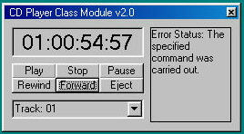



## CD Class Module v2\.1 \*Updated\*

### Description

Easily create a feature rich cd player with this class module. Designed to be very easy to use. Contains over 30 functions wrapped up in a small class module. I also included a basic example on how to use the module. You can visit my webpage at: www.vbcodesource.com or email me at: help@vbcodesource.com.

Update: Added support for selecting a cdrom drive to play from instead of the default cd drive.
 
### More Info
 

             |
---                |---
**Submitted On**   |2002-04-24 11:33:54
**By**             |[Jason Hensley](https://github.com/Planet-Source-Code/PSCIndex/blob/master/ByAuthor/jason-hensley.md)
**Level**          |Beginner
**User Rating**    |5.0 (20 globes from 4 users)
**Compatibility**  |VB 4\.0 \(32\-bit\), VB 5\.0, VB 6\.0
**Category**       |[Sound/MP3](https://github.com/Planet-Source-Code/PSCIndex/blob/master/ByCategory/sound-mp3__1-45.md)
**World**          |[Visual Basic](https://github.com/Planet-Source-Code/PSCIndex/blob/master/ByWorld/visual-basic.md)
**Archive File**   |[CD\_Class\_M752744242002\.zip](https://github.com/Planet-Source-Code/jason-hensley-cd-class-module-v2-1-updated__1-34081/archive/master.zip)

